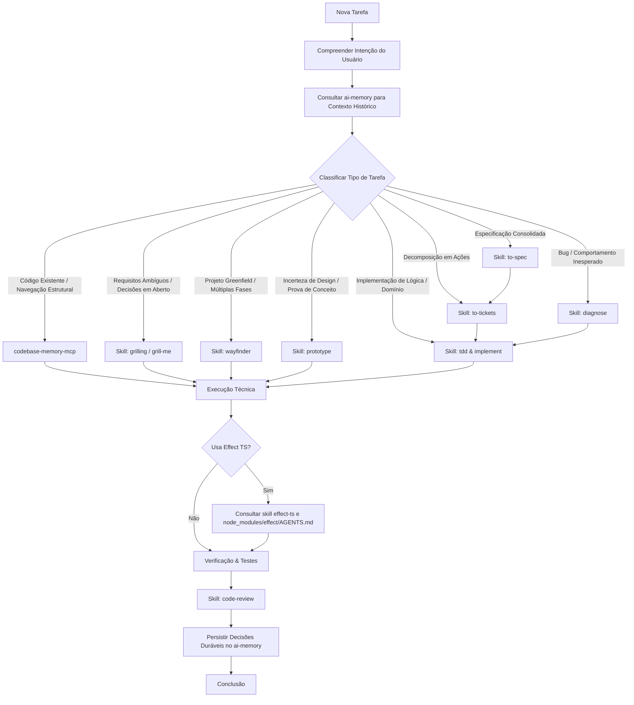

# Agent Task Execution Workflow

Este workflow descreve a sequência de raciocínio e execução que os agentes (Antigravity, Claude Code, Codex) seguem ao trabalhar em tarefas neste workspace (`acad`).

---

## Fluxo de Decisão (Decision Tree)

---

## 1. Descoberta e Contexto Histórico (ai-memory)
- **Antes do trabalho:** Consultar proativamente o `ai-memory` quando decisões arquiteturais, investigações anteriores, trade-offs ou convenções prévias puderem impactar a tarefa.
- **O que evitar:** Não consultar para tarefas puramente triviais ou mecânicas (ex: formatação, sintaxe óbvia).

## 2. Entendimento Estrutural (codebase-memory-mcp)
- Usar `codebase-memory-mcp` para localizar símbolos, grafos de chamadas, analisadores de dependências e entender relações entre módulos.
- Preferir análise estrutural a `grep` cego ou leitura indiscriminada de múltiplos arquivos.

## 3. Alinhamento e Especificação (Matt Pocock Skills)
- **Requisitos ambíguos:** Usar `grilling` para fazer perguntas progressivas com recomendações concretas.
- **Projetos grandes/greenfield:** Usar `wayfinder` para traçar rotas e sequenciamento de fases.
- **Validação de ideia:** Usar `prototype` para protótipos descartáveis.
- **Formalização:** Usar `to-spec` quando requisitos estabilizarem.
- **Tarefas acionáveis:** Usar `to-tickets` para decompor em `.scratch/`.

## 4. Implementação e Código
- **TDD:** Usar TDD para regras de negócio, parsers, transformações, APIs e correções de bugs.
- **Effect-TS:** Consultar obrigatoriamente a skill `effect-ts` e `node_modules/effect/AGENTS.md` antes de escrever ou alterar código Effect.
- **Autonomia:** O agente deve localizar arquivos, inspecionar dependências e rodar testes de forma autônoma sem fazer perguntas triviais ao usuário.
- **Sem cerimônia:** Não gerar planos gigantes para alterações pequenas nem invocar todas as ferramentas desnecessariamente.

## 5. Verificação, Revisão e Conclusão
- Validar as alterações executando testes reais.
- Aplicar `code-review` proporcional ao tamanho e risco da mudança.
- **Após o trabalho:** Persistir decisões arquiteturais duráveis, lições aprendidas e trade-offs no `ai-memory`.
